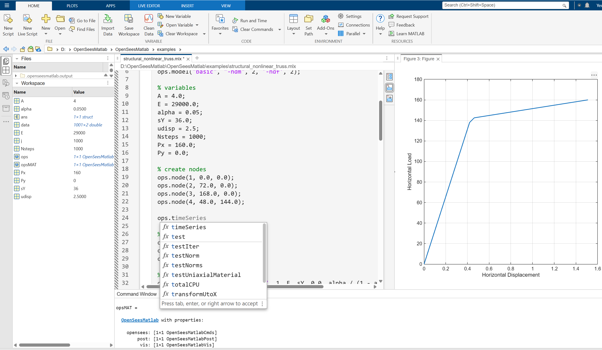
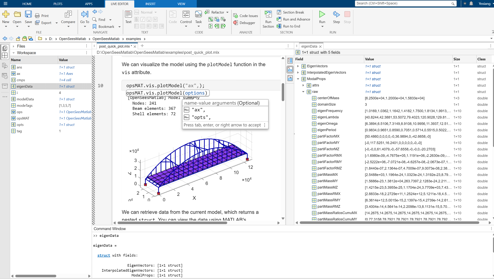

# OpenSeesMatlab

[](https://openseesmatlab.readthedocs.io/en/latest/)
[](https://github.com/yexiang92/OpenSeesMatlab/actions/workflows/matlab-tests.yml)
[](https://github.com/yexiang92/OpenSeesMatlab)

OpenSeesMatlab wraps the [OpenSees engine](https://github.com/OpenSees/OpenSees) in a native MATLAB interface for
structural analysis and simulation. It provides integrated modeling, analysis,
post-processing, and visualization tools for research and engineering
applications in structural, earthquake, and geotechnical engineering.





## Documentation

[https://openseesmatlab.readthedocs.io/en/latest/](https://openseesmatlab.readthedocs.io/en/latest/)

## OpenSees Integration

OpenSeesMatlab leverages MATLAB's C++ mex interface to encapsulate the [OpenSees engine](https://opensees.github.io/OpenSeesDocumentation/), enabling seamless and interactive use of OpenSees directly within MATLAB. This allows users to:

- Run OpenSees commands and analyses natively in MATLAB scripts and functions
- Benefit from MATLAB's interactive environment for pre/post-processing and visualization
- Integrate OpenSees with MATLAB toolboxes and workflows

## Installation

1. Open [GitHub Releases](https://github.com/yexiang92/OpenSeesMatlab/releases) or [Gitee Releases](https://gitee.com/yexiang-yan/opensees-interface-for-matlab/releases), then download only the package for your computer:

   - Windows x86-64: `OpenSeesMatlab-<version>-win64.mltbx`
   - macOS Apple silicon: `OpenSeesMatlab-<version>-maca64.mltbx`

2. Put the downloaded `.mltbx` and `installOpenSeesMatlab.m` in one directory, open that directory in MATLAB, and run:

   ```matlab
   installOpenSeesMatlab
   ```

After installation, explore and run example models in the `examples/` directory
(use it as the MATLAB working directory):

- Open any `.m` file in `examples/` with MATLAB Live Editor, e.g.:
  - `examples/earthquake_NLSMRF.m`
  - `examples/earthquake_Two_Story_Steel_MRF.m`
  - `examples/earthquake_frame3D_transient.m`
  - `examples/structural_nonlinear_truss.m`
  - `examples/geotechnical_PM4Sand.m`
  - `examples/post_2d_Portal_Frame.m`
- Click "Run" in MATLAB to execute and interact with the example.

The generated scripts and illustrated walkthroughs are also available in the
[online examples](https://openseesmatlab.readthedocs.io/en/latest/examples/).

### Building release toolboxes

The OpenSeesBindings repository produces one universal OpenSeesNexus MATLAB
package containing Windows x86-64 and macOS Apple silicon. Keep that package
beside this repository, or set `OPENSEES_NEXUS_MATLAB_ROOT` to an extracted
copy. During publishing, `publish.m` copies that complete directory to
`OpenSeesMatlab/+ops/OpenSeesNexus` and selects only the current platform for
the generated toolbox. The Polyscope
MEX binary is built in the polyscope-matlab repository; place its current
platform file here:

```text
OpenSeesMatlab/+plotter/+polyscope/vendor/+polyscope/private/polyscope_mex.<mexext>
```

Keep any required runtime DLLs or dylibs beside the MEX module that uses them.
Then run `publish.m` once with Windows MATLAB and once with native
Apple-silicon MATLAB. The output files are:

```text
release/<version>/windows-x86_64/
├── OpenSeesMatlab-<version>-win64.mltbx
├── installOpenSeesMatlab.m
└── examples/

release/<version>/macos-aarch64/
├── OpenSeesMatlab-<version>-maca64.mltbx
├── installOpenSeesMatlab.m
└── examples/
```

Distribute the matching platform directory, or archive each platform directory
as one release asset. The script reads the version from the
embedded OpenSeesNexus MEX module, preserves the toolbox identifier, records
the current supported platform, verifies both native modules, and excludes
binaries for other systems.

## Quick Start

Using `OpenSeesMatlab` is straightforward:

- The **`opensees`** module provides wrappers for almost all OpenSees commands, keeping the same parameter parsing style as OpenSees/OpenSeesPy.
- Modules such as **`vis`**, **`post`**, and **`pre`** extend functionality with visualization, post-processing, and preprocessing tools, which can be used as needed.

```matlab
opsMat = OpenSeesMatlab();   % Get instance
ops = opsMat.opensees;       % Access OpenSees command interface

ops.wipe();
ops.model('basic', '-ndm', 2, '-ndf', 3);

ops.node(1, 0.0, 0.0);
ops.node(2, 5.0, 0.0);
ops.fix(1, 1, 1, 1);

A = 2.e-3;
Iz = 1.6e-5;
E = 200.e9;
ops.element('elasticBeamColumn', 1, 1, 2, A, E, Iz, 1)

...

opsMat.post.getModelData();  % Collect model data
opsMat.vis.plotModel();      % Visualize the model
```

`OpenSeesMatlab()` selects the serial backend by default. Run an OpenSeesSP
model through the bundled `OpenSeesSPMatlab` launcher; it discovers MATLAB and
common MPI installations and selects the SP backend inside the launched job.
`OpenSeesMatlab(backend="sp")` is intended for that configured MPI process,
not for switching an already initialized interactive session. The top-level
object reports the interface and engine versions separately as
`bindingVersion` and `openseesVersion`; `version` remains an alias of
`bindingVersion` for existing code.

## OpenSeesMatlab Extensions

Optional extensions integrate MATLAB-native components and GPU acceleration
with the standard OpenSees analysis workflow:

- Define linear or history-dependent uniaxial materials with MATLAB callbacks
- Couple MATLAB numerical substructures to an OpenSees domain
- Solve supported sparse systems with the NVIDIA cuDSS GPU backend, including
  CPU crossover, configurable ordering/pivoting, hybrid execution,
  single-node multi-GPU and Schur-complement controls

See the [extension guides](https://openseesmatlab.readthedocs.io/en/latest/getting_started/extensions/)
for setup instructions and runnable examples. CUDA and cuDSS are optional; CPU
solvers remain available without them.

## 🌟 Features

- 🧱 **`.opensees`** — MATLAB interface to OpenSees commands (fully compatible syntax), implemented via MATLAB MEX wrapping of the OpenSees C++ library
- 📊 **`.post`** — post-processing module for extracting, organizing, and exporting analysis results
- 🏗️ **`.pre`** — preprocessing tools for model definition, units, and data preparation
- 🎨 **`.vis`** — visualization engine for models, responses, and mode shapes
- 📈 **`.anlys`** — high-level analysis workflows and utilities
- 🛠️ **`.utils`** — auxiliary helper functions and common utilities
- 🧩 **Extensions** — MATLAB-defined materials and numerical substructures, plus an optional NVIDIA cuDSS solver

## Requirements

- Windows x86-64: MATLAB R2023a or later
- macOS Apple silicon: native MATLAB R2023b or later

Intel-based macOS and Linux MATLAB are not currently distributed.

## License

This project is licensed for academic research and personal use only. Commercial and closed-source use is prohibited. See the [LICENSE](LICENSE) file for details.
