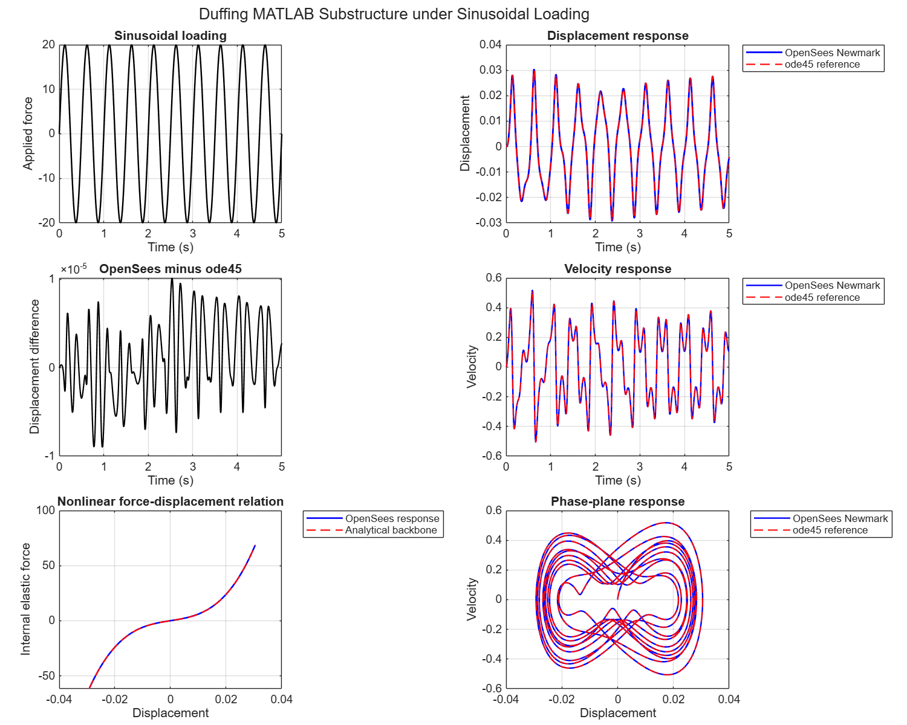
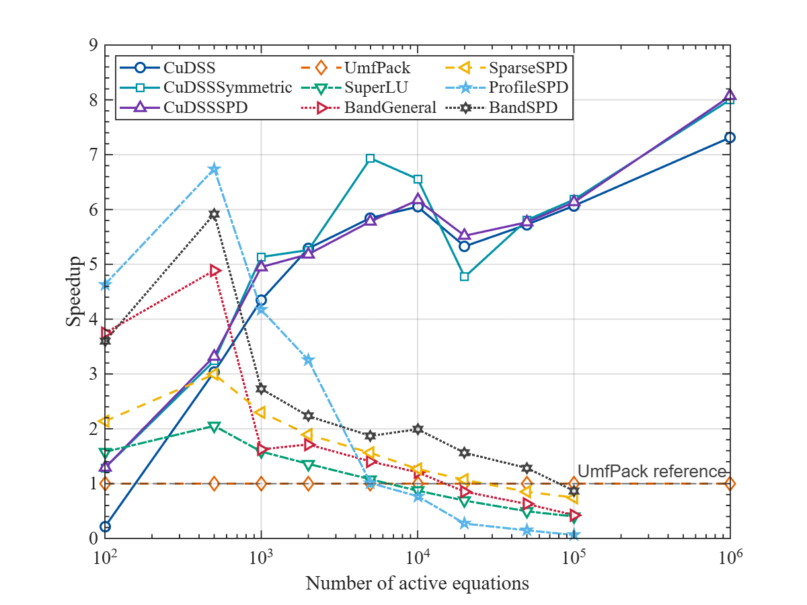
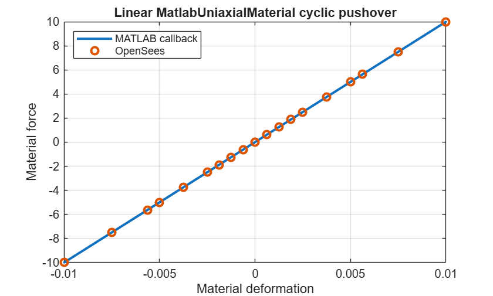
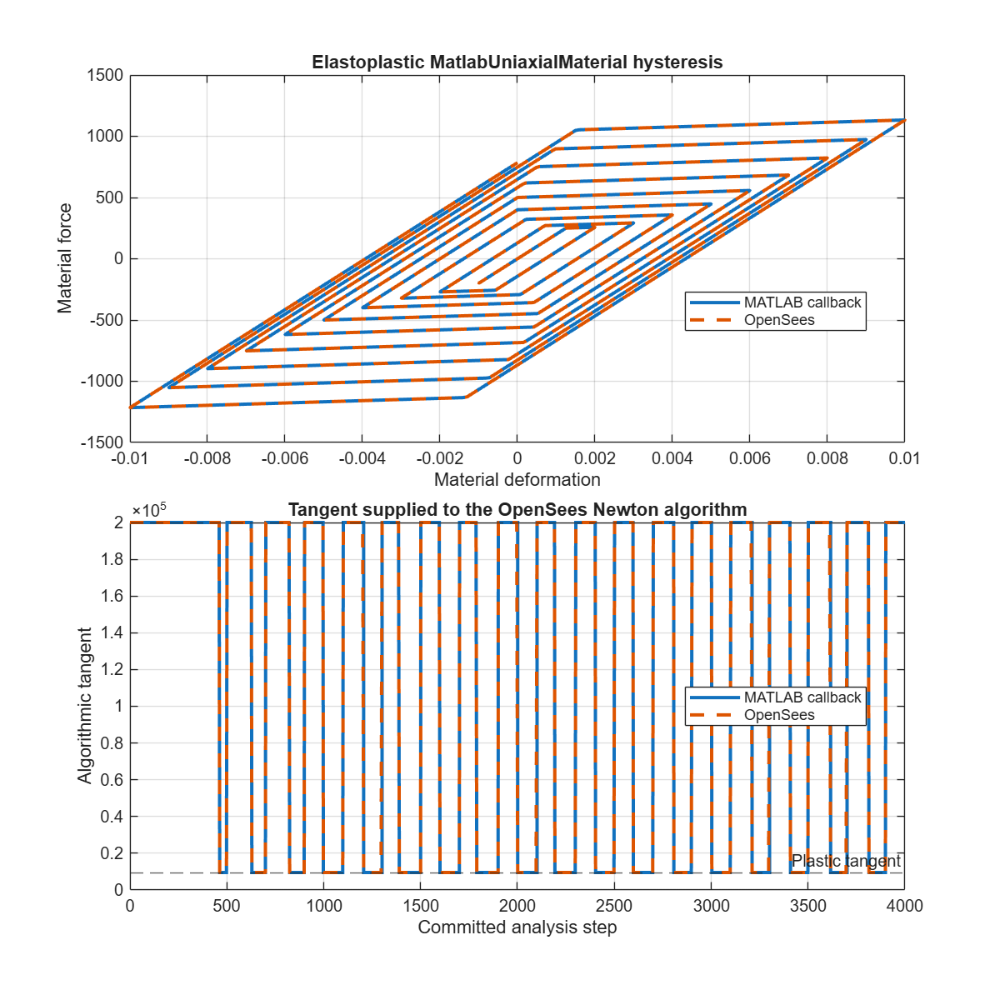
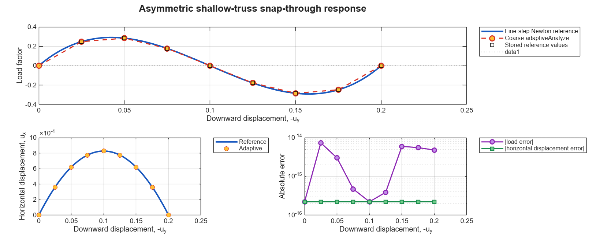
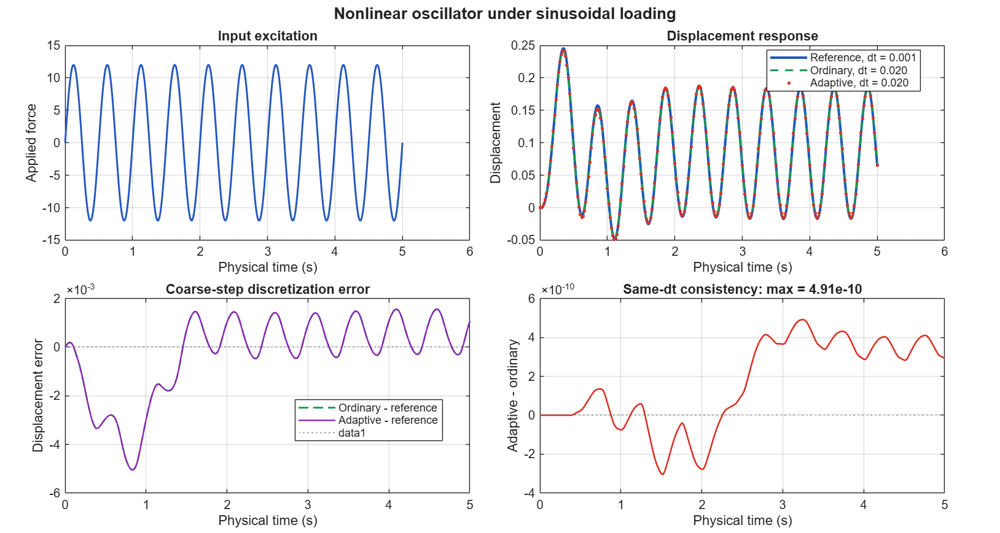
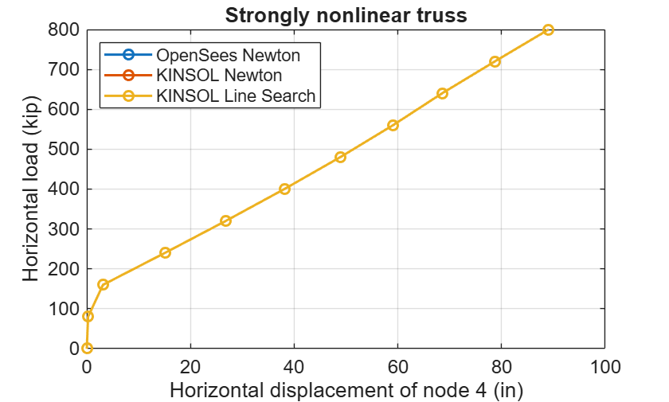
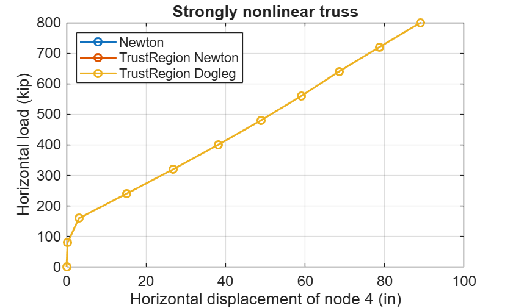

# Extended functionality by OpenSeesMatlab

OpenSeesMatlab extends a range of functionalities, including *numerical substructure analysis* and a *GPU-based linear equation solver*.

## MATLAB Numerical Substructure Analysis

  <a class="example-gallery__card" href="./substruct/extension_substructure_linear.md">
    
    <strong>Linear MATLAB Substructure: Static Analysis and Verification</strong>MATLAB
  </a>
  <a class="example-gallery__card" href="./substruct/extension_substructure_nonlinear_dynamic.md">
    
    <strong>Nonlinear Dynamic MATLAB Substructure</strong>MATLAB
  </a>

## Solver of equations for linear systems

  <a class="example-gallery__card" href="./system/extension_gpu_CuDSS_test.md">
    
    <strong>cuDSS: CPU/GPU sparse-solver comparison</strong>MATLAB
  </a>

## Connecting MATLAB's custom materials to the OpenSees domain

  <a class="example-gallery__card" href="./material/extension_MatlabUniaxialMaterial_linear.md">
    
    <strong>Linear MATLAB Material</strong>MATLAB
  </a>
  <a class="example-gallery__card" href="./material/extension_MatlabUniaxialMaterial_nonlinear.md">
    
    <strong>History-Dependent Nonlinear MATLAB Material in a Cyclic Pushover</strong>MATLAB
  </a>

## Adaptive Analysis

  <a class="example-gallery__card" href="./adaptiveAnalyze/extension_adaptiveAnalyze_static.md">
    
    <strong>Strongly nonlinear snap-through example for adaptiveAnalyze</strong>MATLAB
  </a>
  <a class="example-gallery__card" href="./adaptiveAnalyze/extension_adaptiveAnalyze_dynamic.md">
    
    <strong>Strongly nonlinear dynamic demonstration of adaptiveAnalyze</strong>MATLAB
  </a>

## Nonlinear iterative algorithm

  <a class="example-gallery__card" href="./algorithm/extension_KINSOL_steel_frame_benchmark.md">
    
    <strong>KINSOL Methods for a Strongly Nonlinear Truss</strong>MATLAB
  </a>
  <a class="example-gallery__card" href="./algorithm/extension_TrustRegion_steel_frame_benchmark.md">
    
    <strong>Trust-region Methods for a Strongly Nonlinear Truss</strong>MATLAB
  </a>

