# OpenSees command examples

These examples demonstrate how to use the encapsulated OpenSees module for modeling and analysis.

## Structural Examples

  <a class="example-gallery__card" href="./structural/structural_nonlinear_truss.md">
    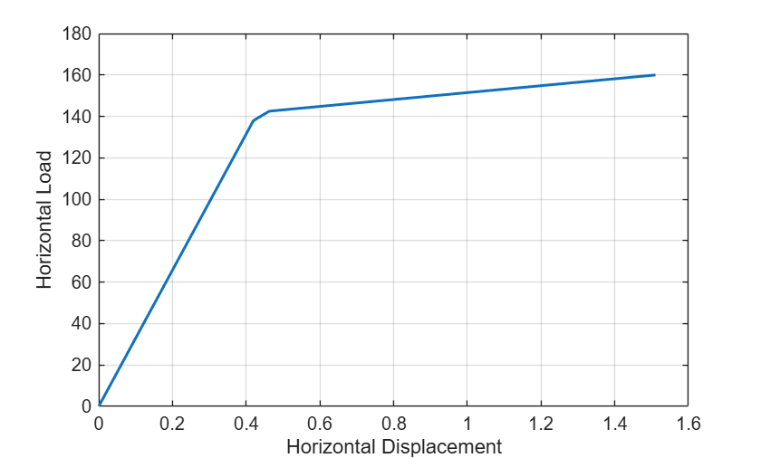
    <strong>Nonlinear Truss Pushover Analysis</strong>MATLAB
  </a>
  <a class="example-gallery__card" href="./structural/structural_steel_frame2d.md">
    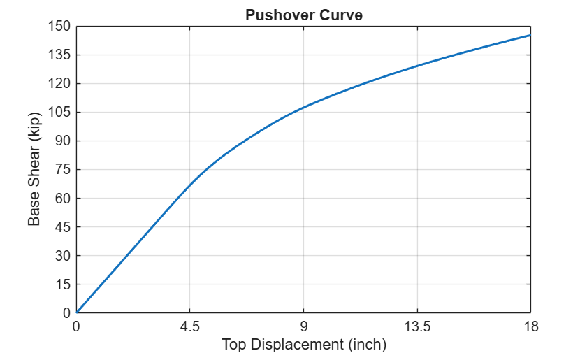
    <strong>2D Steel Frame Pushover Analysis</strong>MATLAB
  </a>
  <a class="example-gallery__card" href="./structural/structural_mvlem3d_force_controlled.md">
    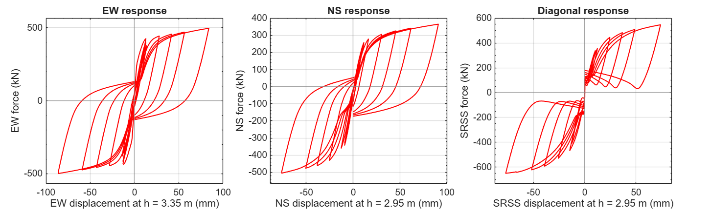
    <strong>Force-controlled cyclic analysis of the TUB MVLEM_3D wall</strong>MATLAB
  </a>

## Earthquake Examples

  <a class="example-gallery__card" href="./earthquake/earthquake_NLSMRF.md">
    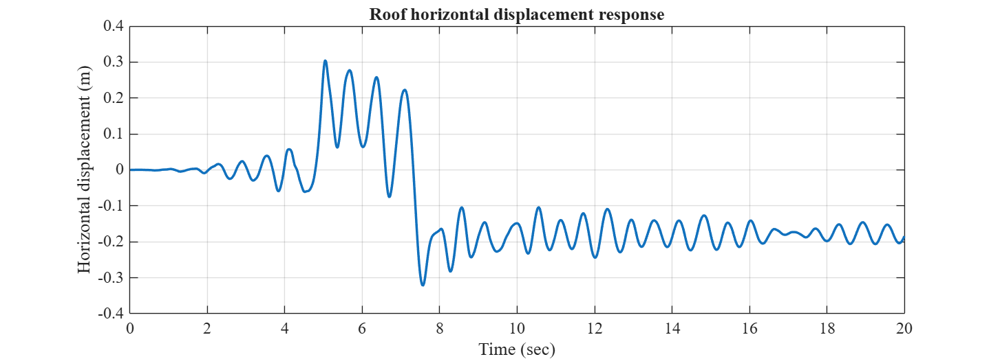
    <strong>Nonlinear seismic response of a moment resisting frame</strong>MATLAB
  </a>
  <a class="example-gallery__card" href="./earthquake/earthquake_frame3D_transient.md">
    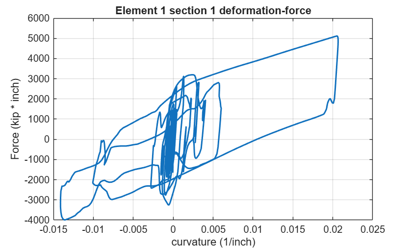
    <strong>3D Nonlinear beam-column elements Gravity load analysis followed by transient analysis</strong>MATLAB
  </a>
  <a class="example-gallery__card" href="./earthquake/earthquake_RC_FRAME_EQ1.md">
    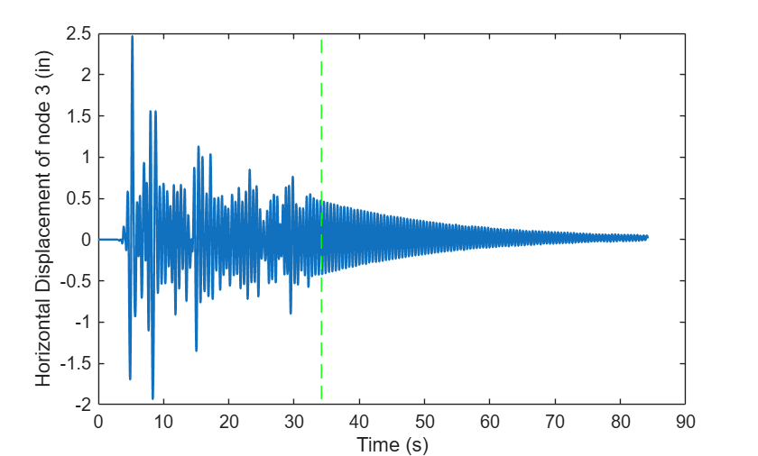
    <strong>Reinforced Concrete Frame Earthquake Analysis</strong>MATLAB
  </a>
  <a class="example-gallery__card" href="./earthquake/earthquake_Two_Story_Steel_MRF.md">
    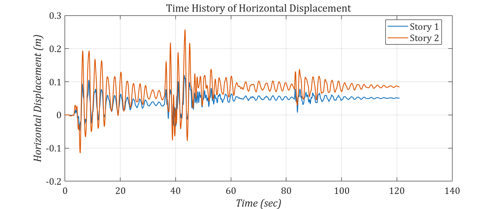
    <strong>Two-story steel MRF in OpenSeesMatlab style</strong>MATLAB
  </a>

## Geotechnical Examples

  <a class="example-gallery__card" href="./geotechnical/geotechnical_PM4Sand.md">
    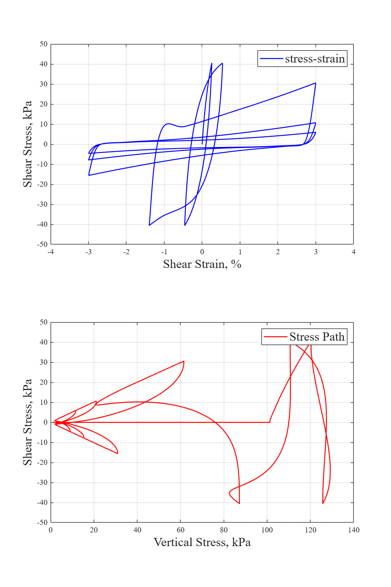
    <strong>PM4Sand model undrained cyclic simple shear element</strong>MATLAB
  </a>
  <a class="example-gallery__card" href="./geotechnical/geotechnical_PressureDependMultiYield6.md">
    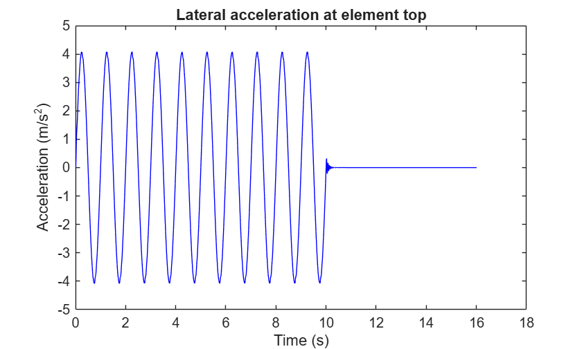
    <strong>Dry single BbarBrick element with pressure dependent material</strong>MATLAB
  </a>

## Thermal Examples

  <a class="example-gallery__card" href="./thermal/thermal_restrained_beam_under_thermal_expansion.md">
    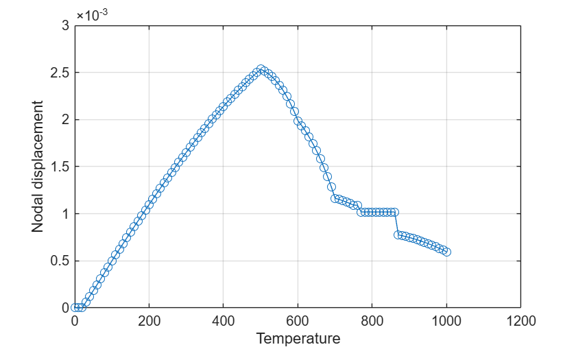
    <strong>Restrained beam under thermal expansion</strong>MATLAB
  </a>

## Sensitivity Examples

  <a class="example-gallery__card" href="./sensitivity/sensitivity_sensitivity_analysis.md">
    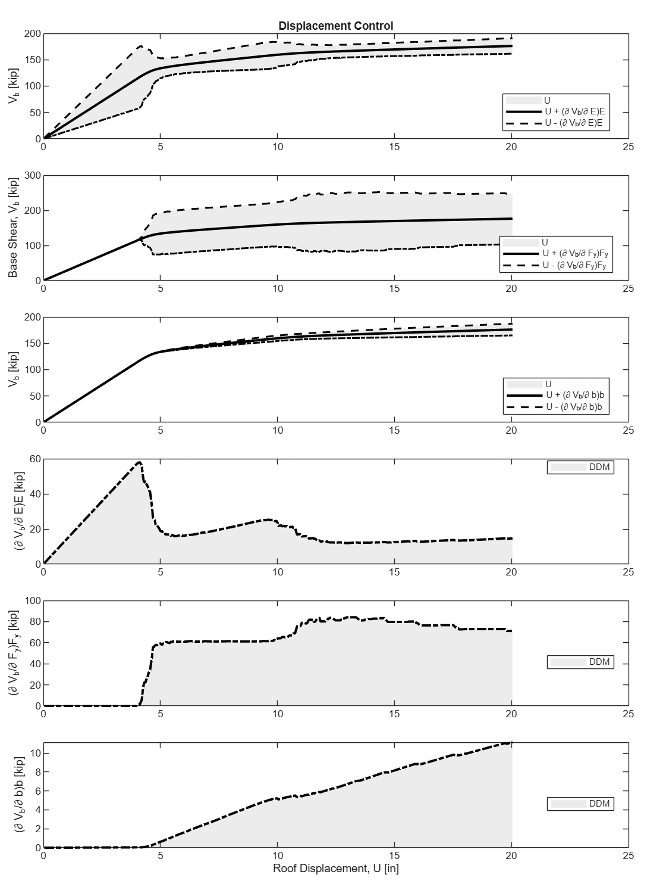
    <strong>Two storey steel moment frame with W-sections for displacement-controlled sensitivity analysis</strong>MATLAB
  </a>

## Parallel Examples

  <a class="example-gallery__card" href="./parallel/parallel_openseessp_plane_100k.md">
    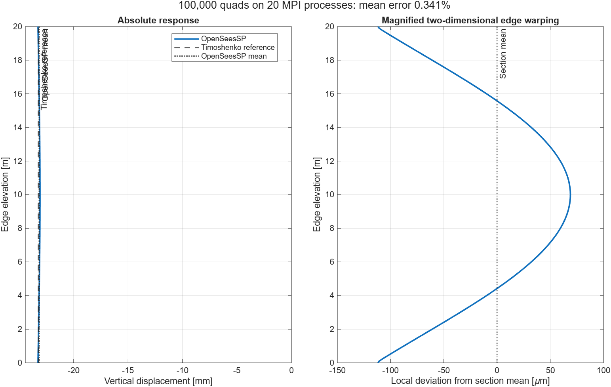
    <strong>100,000-element plane-stress model with OpenSeesSP</strong>MATLAB
  </a>
  <a class="example-gallery__card" href="./parallel/parallel_openseessp_nonlinear_pushover.md">
    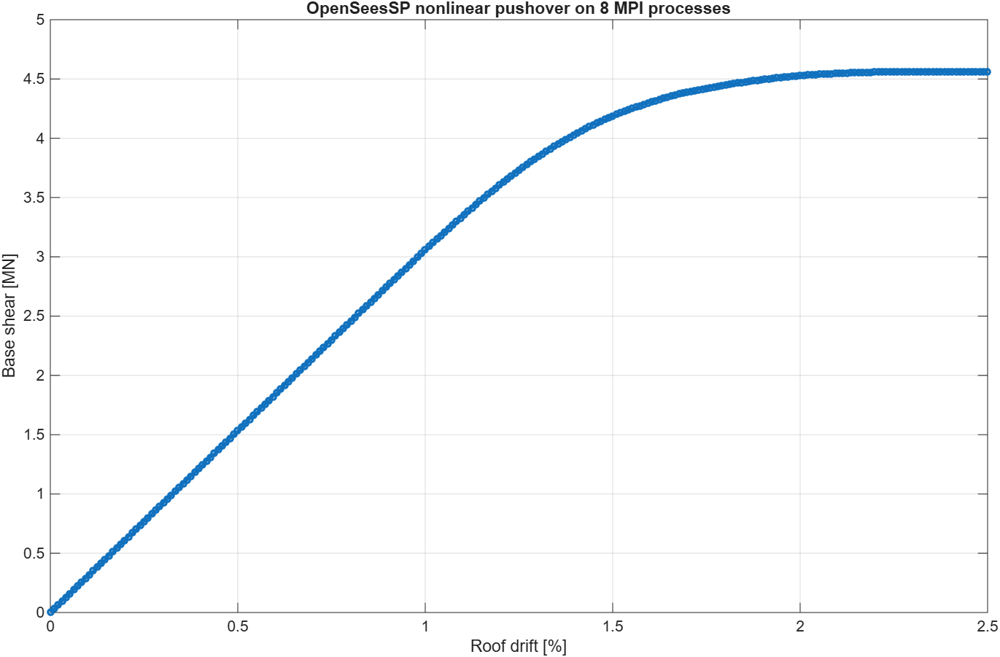
    <strong>Nonlinear frame pushover with OpenSeesSP</strong>MATLAB
  </a>
  <a class="example-gallery__card" href="./parallel/parallel_structural_parfor_truss.md">
    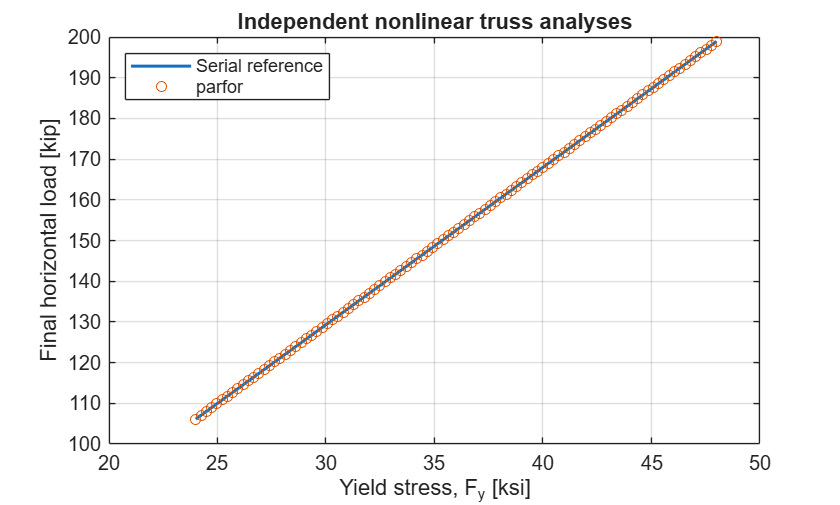
    <strong>Run independent OpenSees models with parfor</strong>MATLAB
  </a>

