# Pre, Post-processing and Visualization Examples

Examples for additional preprocessing, post-processing, and visualization features provided by ``OpenSeesMatlab``.

## Basic Utilities

  <a class="example-gallery__card" href="./basic/post_quick_plot.md">
    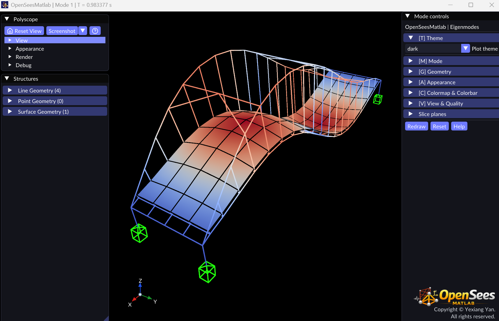
    <strong>Quick Model and Eigen Visualization</strong>MATLAB
  </a>
  <a class="example-gallery__card" href="./basic/post_get_model_data.md">
    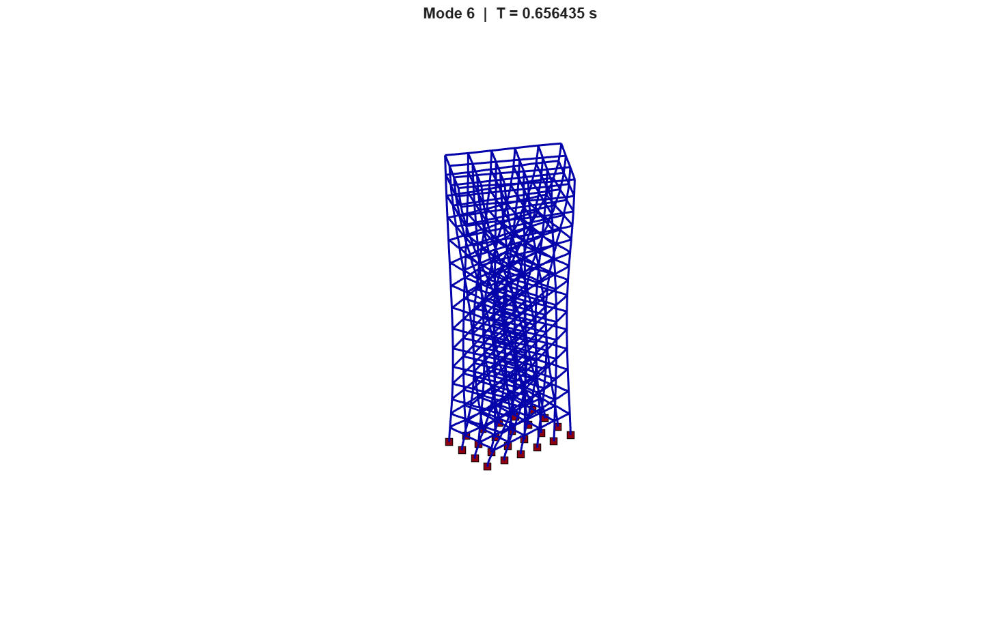
    <strong>Retrieval Model and Eigenvalue Analysis Data</strong>MATLAB
  </a>
  <a class="example-gallery__card" href="./basic/post_get_resp_odb.md">
    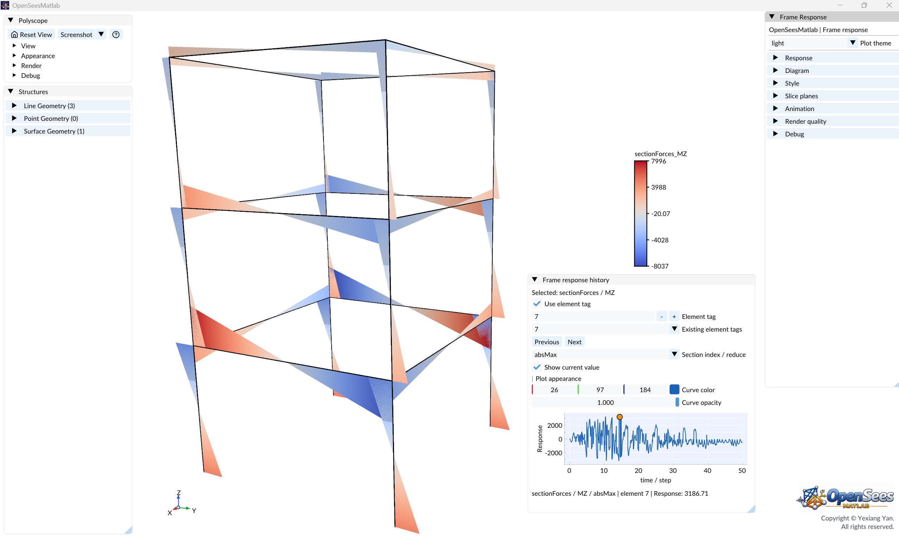
    <strong>Analysis results retrieval, saving and visualization</strong>MATLAB
  </a>

## Visualization

  <a class="example-gallery__card" href="./visualization/post_2d_Portal_Frame.md">
    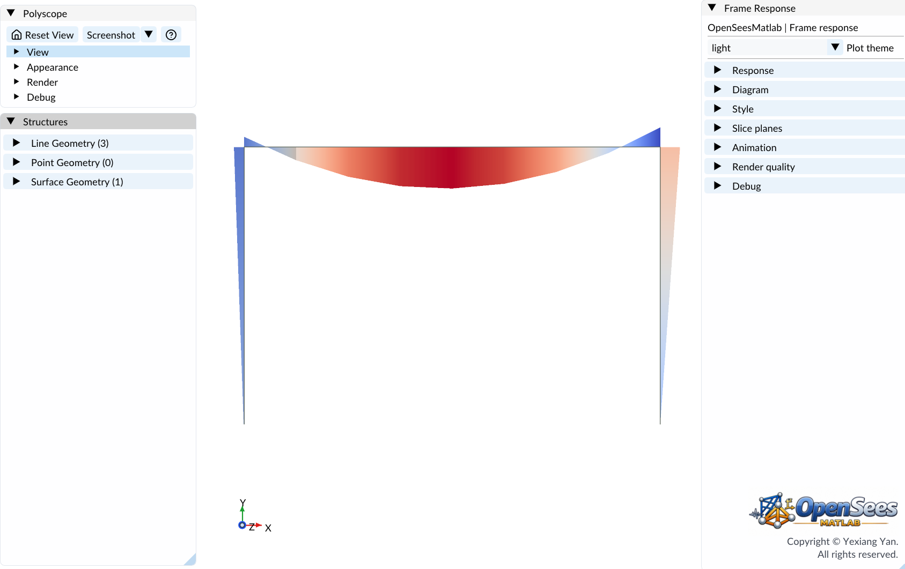
    <strong>Static analysis and visualization of 2D Portal Frame</strong>MATLAB
  </a>
  <a class="example-gallery__card" href="./visualization/post_soil_structure_interaction_2d_portal_frame.md">
    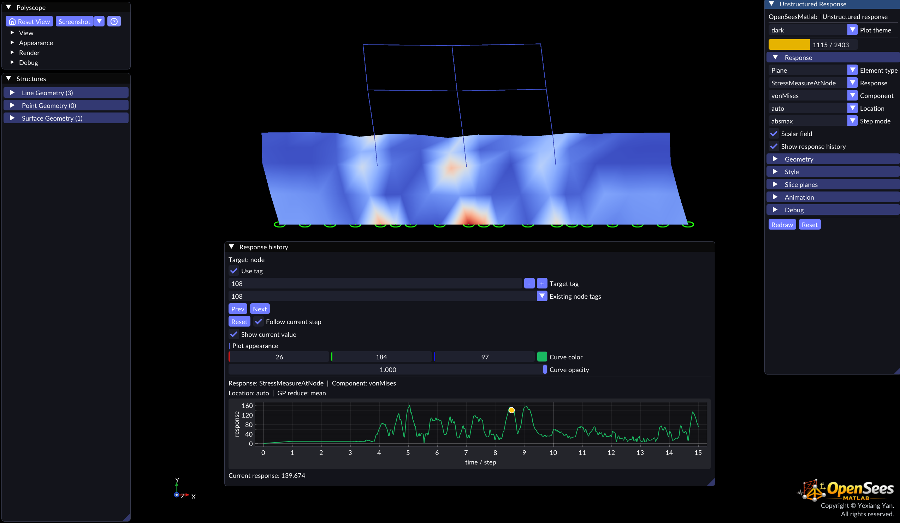
    <strong>Soil-structure interaction: 2d Portal Frame</strong>MATLAB
  </a>
  <a class="example-gallery__card" href="./visualization/post_excavation.md">
    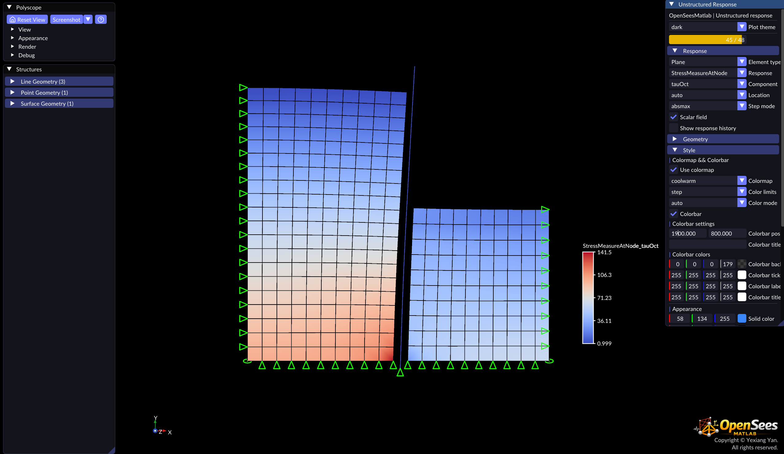
    <strong>Excavation Supported by Cantilevered Sheet Pile Wall</strong>MATLAB
  </a>

## Preprocessing

  <a class="example-gallery__card" href="./preprocess/post_getMCK.md">
    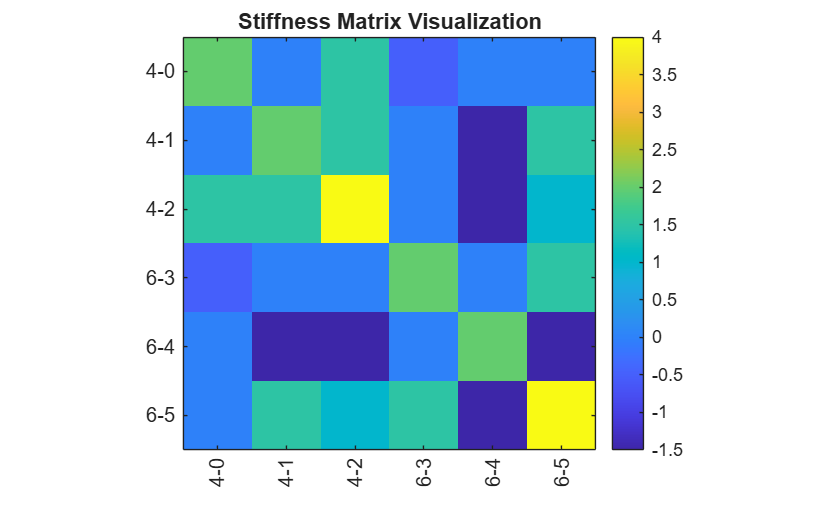
    <strong>Quickly apply gravity loads and obtain mass and stiffness matrices</strong>MATLAB
  </a>
  <a class="example-gallery__card" href="./preprocess/post_loads.md">
    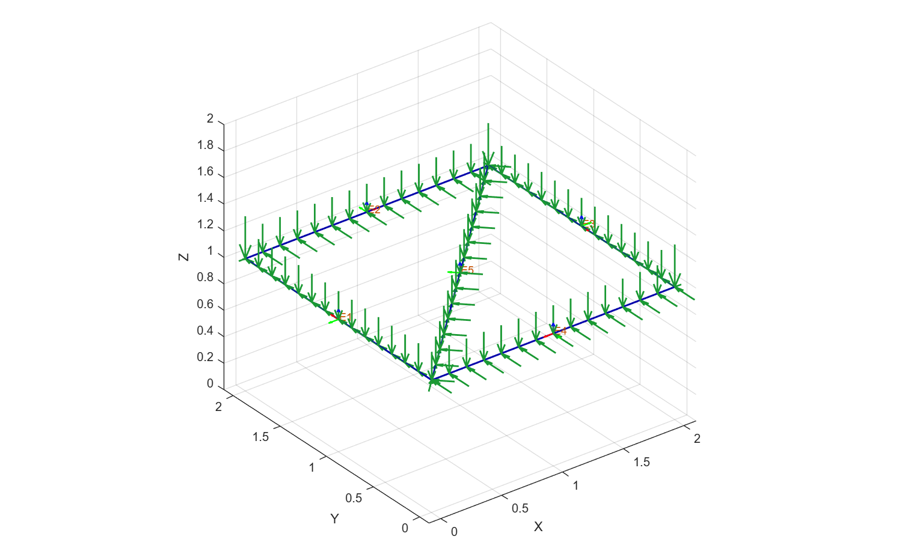
    <strong>Loads Processing</strong>MATLAB
  </a>
  <a class="example-gallery__card" href="./preprocess/post_unitsystem.md">
    
    <strong>Automatic Unit System Conversion</strong>MATLAB
  </a>
  <a class="example-gallery__card" href="./preprocess/post_Gmsh2OPS_solid.md">
    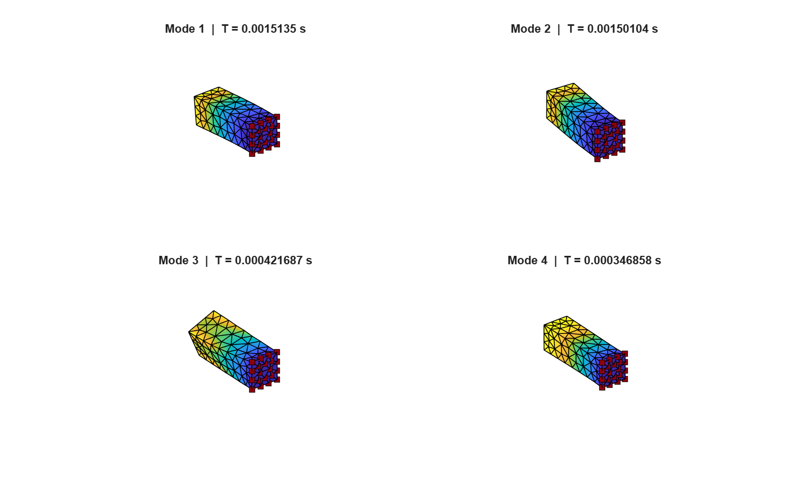
    <strong>Read a GMSH model by physical groups</strong>MATLAB
  </a>

## Fiber Sections

  <a class="example-gallery__card" href="./section/post_plot_fiber_section.md">
    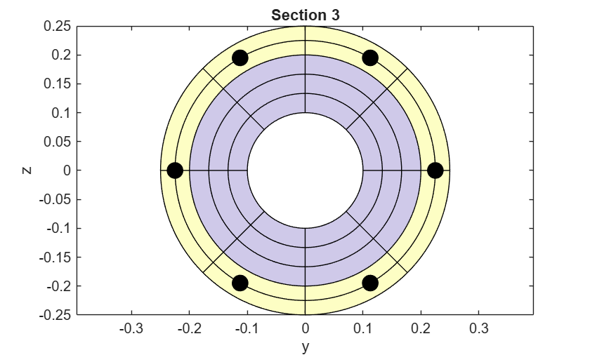
    <strong>Plot steel and reinforced concrete fiber sections</strong>MATLAB
  </a>
  <a class="example-gallery__card" href="./section/post_section_mesh.md">
    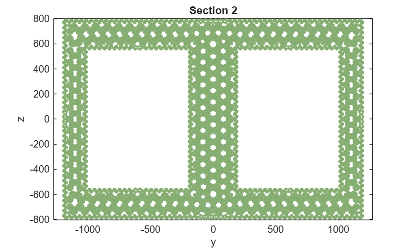
    <strong>Fiber section mesh generation</strong>MATLAB
  </a>

## Analysis Utilities

  <a class="example-gallery__card" href="./analysis/post_mphi_analysis.md">
    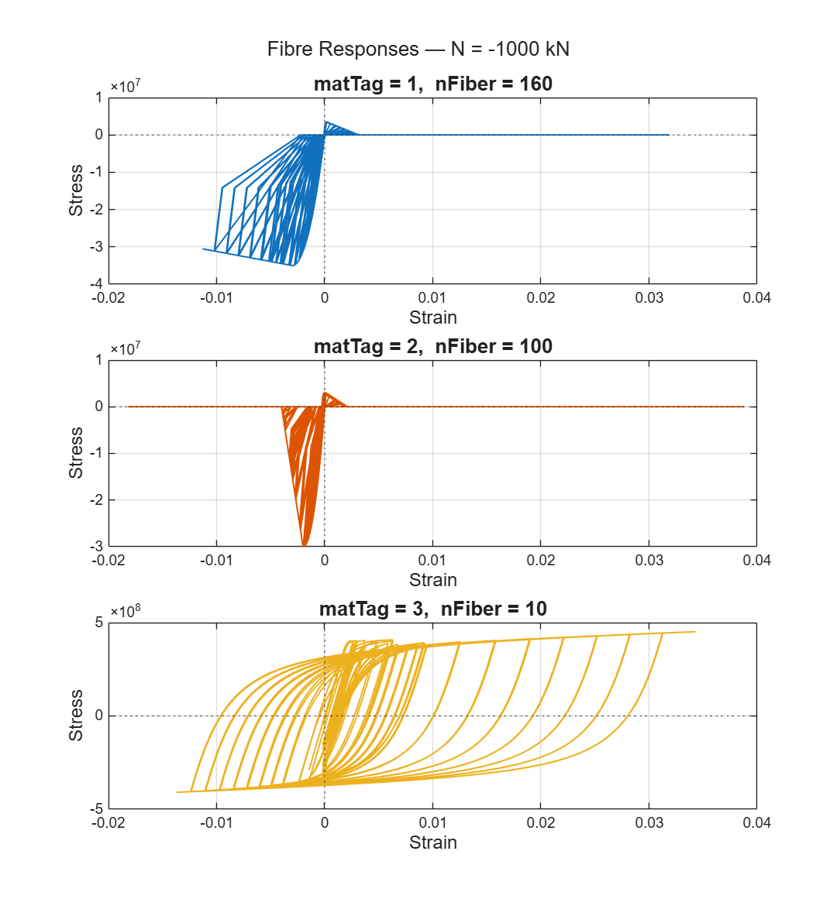
    <strong>Moment-Curvature Analysis of a Reinforced Concrete Column Section</strong>MATLAB
  </a>

