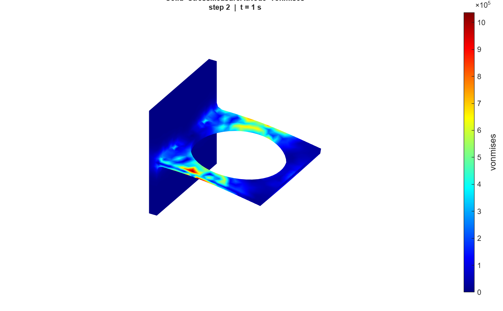
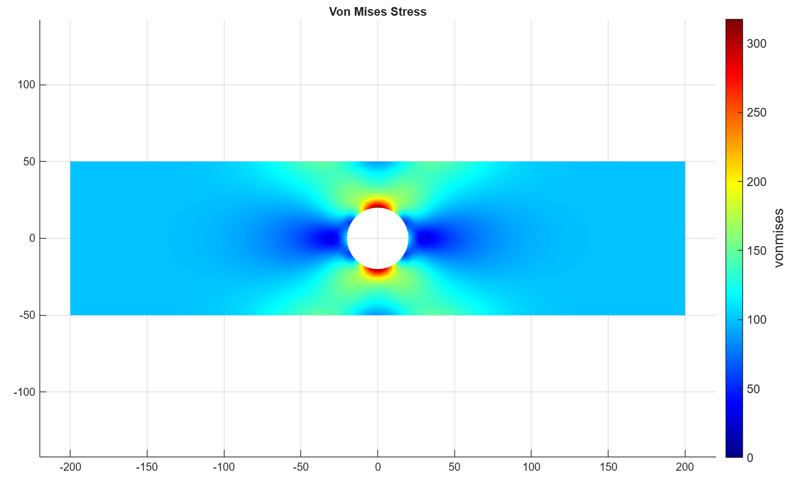
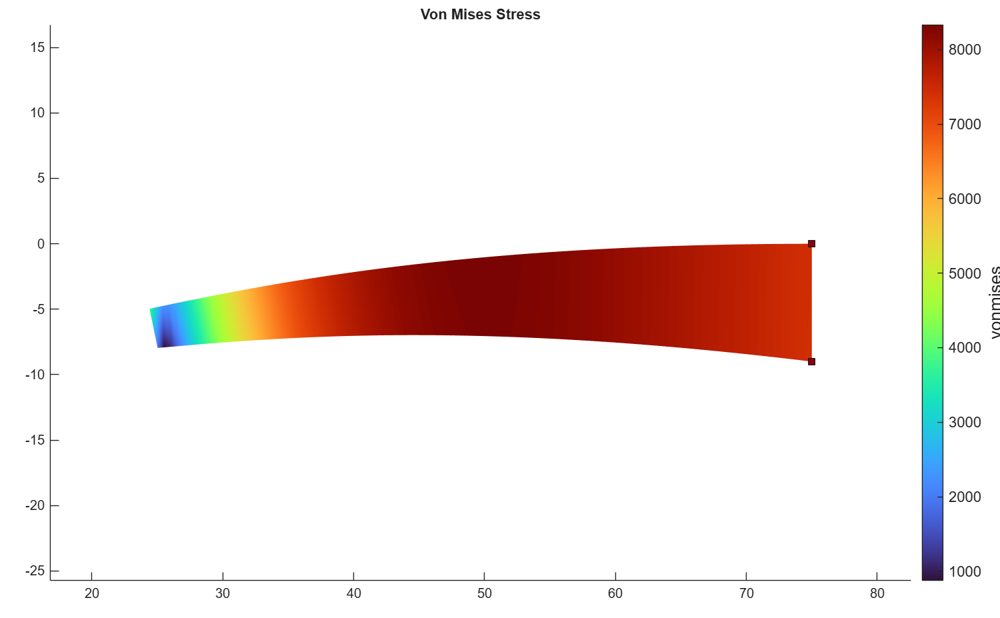
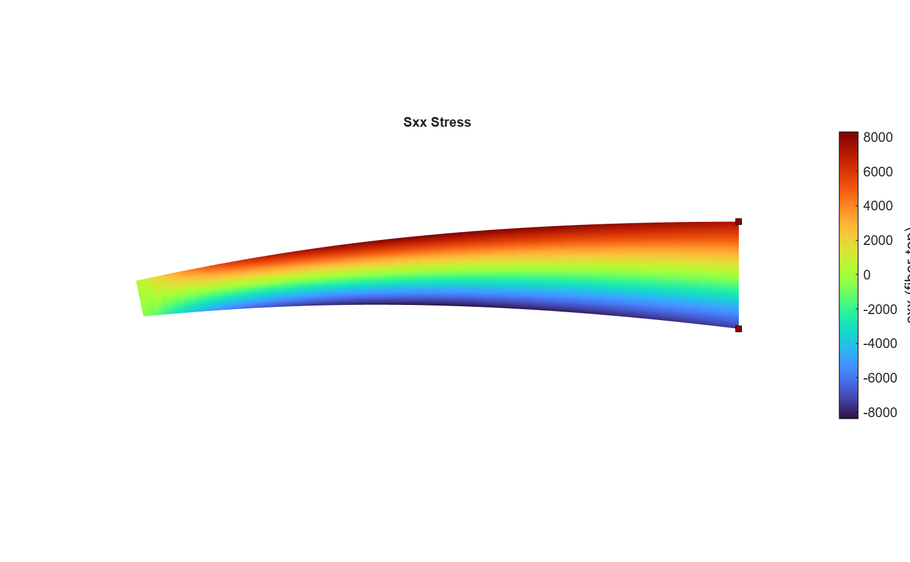
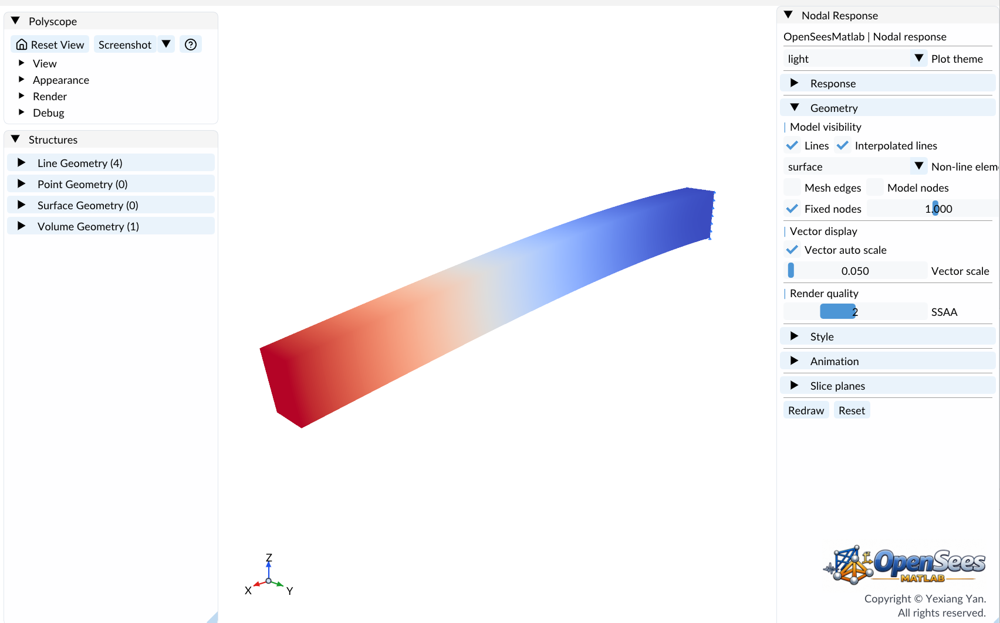
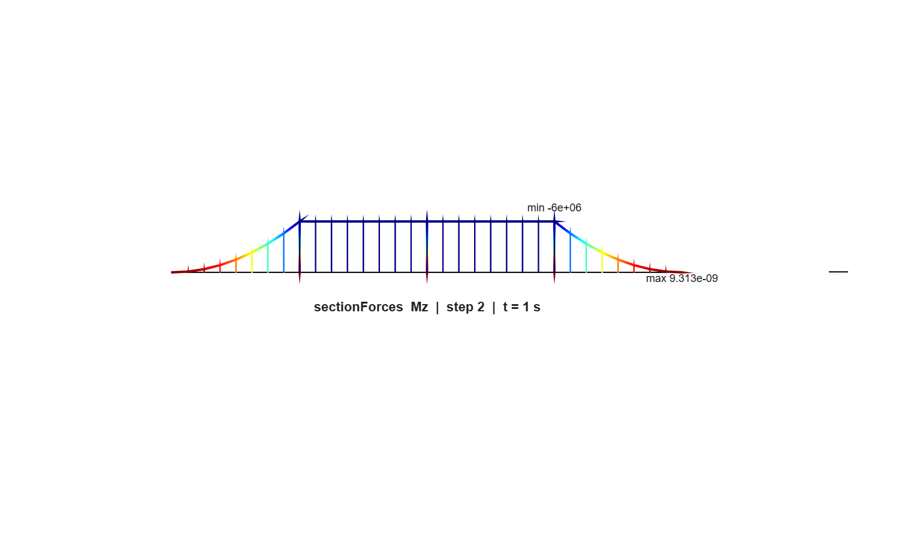

# Verification Examples

Examples of verification by reliable third-party software.

  <a class="example-gallery__card" href="./verify_Bracket.md">
    
    <strong>Deflection Analysis of Bracket</strong>MATLAB
  </a>
  <a class="example-gallery__card" href="./verify_stress_concentration_plate.md">
    
    <strong>Stress Concentration in Plate with Circular Hole</strong>MATLAB
  </a>
  <a class="example-gallery__card" href="./verify_quad_beam.md">
    
    <strong>Laterally loaded tapered support structure (Quad plane element)</strong>MATLAB
  </a>
  <a class="example-gallery__card" href="./verify_quad_shell.md">
    
    <strong>Laterally loaded tapered support structure (Shell element)</strong>MATLAB
  </a>
  <a class="example-gallery__card" href="./verify_stdBrick.md">
    
    <strong>3D Solid Cantilever Beam (Brick element)</strong>MATLAB
  </a>
  <a class="example-gallery__card" href="./verify_beam.md">
    
    <strong>Beam stresses and deflections (Beam-Column)</strong>MATLAB
  </a>

